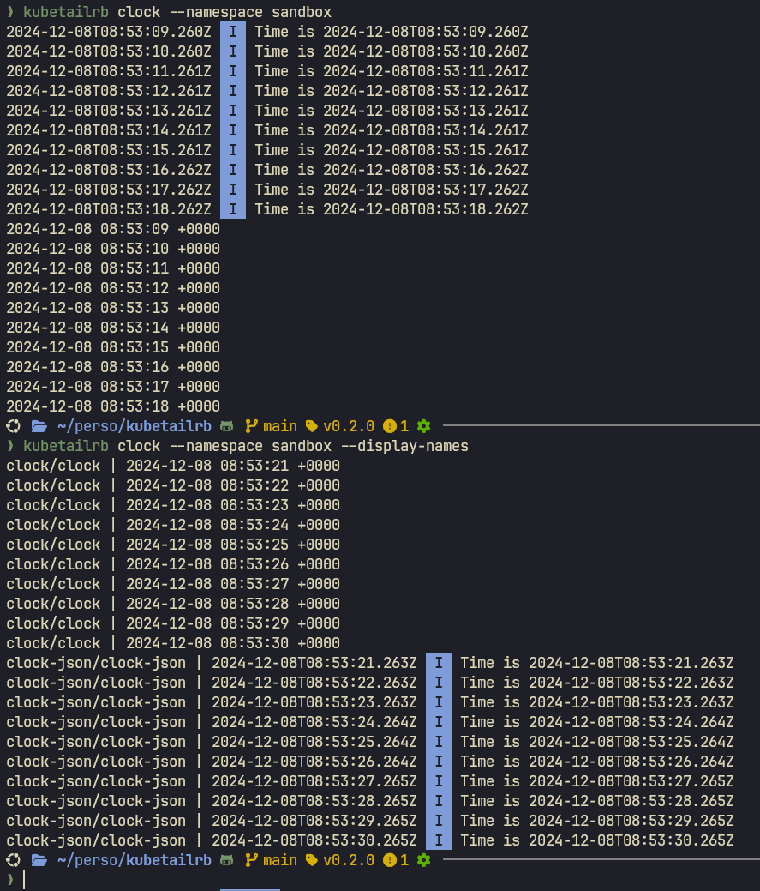

# Kubetailrb

> Tail your Kubernetes pod logs at the same time.

> [!NOTE]
> This project is a pet project I used to learn the [Ruby programming language](https://www.ruby-lang.org/en/).
> So you might find lots of my [personal notes](./journey_log.md) in the codebase.
>
> If you want to have something that works, please look at the following
> projects that were used as inspirations instead:
>
> - https://github.com/stern/stern
> - https://github.com/johanhaleby/kubetail



## Installation

```sh
# Install dependencies.
./bin/setup

# Install gem onto your local machine
bundle exec rake install
```

## Usage

```bash
# show help
kubetailrb -h

# follow pod logs
kubetailrb 'clock' --namespace sandbox

# follow pod structured JSON logs and display in human friendly way
kubetailrb 'clock-json' --namespace sandbox --pretty --raw --follow
# or with shorter flags
kubetailrb 'clock-json' -n sandbox -p -r -f

# you can filter the pods using regex on the pod names
kubetailrb '^clock(?!-json)' -n sandbox -p -r

```

## Development

```bash
# Open interactive prompt to allow you to experiment.
./bin/console

# Release new version
NEW_VERSION=1.0.1 \
  && sed "s/VERSION = \".*\"/VERSION = \"${NEW_VERSION}\"/" lib/kubetailrb/version.rb
  && bundle exec rake release

# Check available tasks that can be run
bundle exec rake --tasks

# During your development phase, run tests automatically.
bundle exec rake test:watch

# Run tests, cucumber features and lint.
bundle exec rake
```

## Contributing

Bug reports and pull requests are welcome on GitHub at https://github.com/l-lin/kubetailrb.

## License

The gem is available as open source under the terms of the [MIT License](https://opensource.org/licenses/MIT).
